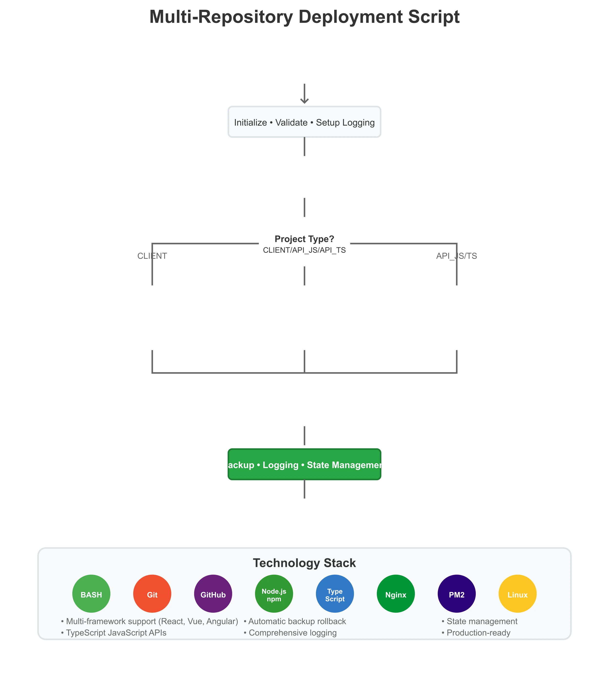

# Multi-Repository Deployment Script

A comprehensive, production-ready bash deployment script that automates the deployment of modern frontend applications (React, Vue, Angular, etc.) and Node.js Express server applications (both TypeScript and JavaScript) with advanced features including backup/rollback, state management, detailed logging, and PM2 process management.



## Features

- **Multi-Project Support**: Handles modern frontend applications (React, Vue, Angular, etc.), Node.js JS/TS APIs, and full-stack applications
- **Automatic Rollback**: Backs up previous deployments and rolls back on failure
- **State Management**: Tracks deployment states with persistent storage
- **Comprehensive Logging**: Detailed verbose logs with retention management
- **PM2 Integration**: Advanced process management for Node.js applications
- **Safety Checks**: Path validation, dependency verification, and error handling
- **Git Integration**: Stash handling, conflict resolution, and change detection
- **Slack Notifications**: Optional deployment status notifications
- **Cleanup Management**: Automatic cleanup of old logs, backups, and states

## Project Types Supported

### CLIENT
- **Description**: Modern frontend applications (React, Vue, Angular)
- **Build Output**: Static files served by Nginx
- **Deployment**: Builds and copies to web root
- **Dependencies**: npm, Node.js

### API_JS
- **Description**: Node.js Express APIs written in JavaScript
- **Runtime**: Direct execution with PM2
- **Deployment**: PM2 process management
- **Dependencies**: npm, Node.js, PM2

### API_TS
- **Description**: Node.js Express APIs written in TypeScript
- **Build Process**: TypeScript compilation required
- **Runtime**: Compiled JavaScript with PM2
- **Dependencies**: npm, Node.js, PM2, TypeScript

### Full-Stack (FULL_STACK=true)
- **Description**: Combined client and server deployment
- **Process**: Deploys server first, then client
- **Components**: Both CLIENT and API (JS/TS) workflows

## Environment Variables

The script automatically receives these variables from the GitHub webhook server:

```bash
GITHUB_REPO_NAME         # Repository name (e.g., "my-app")
GITHUB_REPO_FULL_NAME    # Full name (e.g., "username/my-app")
GITHUB_REPO_OWNER        # Repository owner username
GITHUB_BRANCH            # Branch being deployed
GITHUB_COMMIT            # Full commit hash
GITHUB_PUSHER            # Username who pushed the changes
```

### Optional Variables

```bash
SLACK_WEBHOOK_URL        # Slack webhook for deployment notifications
```

## Configuration Section

### Repository Configuration
Each repository is configured in the main case statement:

```bash
case "$GITHUB_REPO_NAME" in
    "your-repo-name")
        REPO_DIR="/home/${GITHUB_REPO_OWNER}/${GITHUB_REPO_NAME}"
        WEB_ROOT="/var/www/html/${GITHUB_REPO_NAME}"
        PROJECT_TYPE="CLIENT"          # CLIENT, API_JS, or API_TS
        FULL_STACK=false              # true for full-stack projects
        CLIENT_DIR="client"           # Client code directory
        SERVER_DIR="server"           # Server code directory
        SERVER_ENTRY="app.js"         # Server entry point
        ;;
esac
```

### Directory Structure Examples

**CLIENT Project:**
```
your-repo/
├── package.json
├── src/
└── dist/ (or build/)
```

**API Project:**
```
your-repo/
├── package.json
├── src/
├── app.js
└── dist/ (for TypeScript)
```

**Full-Stack Project:**
```
your-repo/
├── client/
│   ├── package.json
│   └── src/
└── server/
    ├── package.json
    ├── app.js
    └── src/
```

## Core Functions

### Logging System
- **Timestamped Logging**: All operations logged with timestamps
- **Color-Coded Output**: Different colors for different log levels
- **Persistent Logs**: Verbose logs stored in `~/logs/deployments/`
- **Log Retention**: Automatically keeps last 20 deployment logs per repository

### Error Handling
- **Graceful Failures**: Comprehensive error handling with descriptive messages
- **Automatic Rollback**: Restores previous deployment on failure
- **State Tracking**: Updates deployment state throughout process
- **Safe Exits**: Proper cleanup before script termination

### State Management
States tracked throughout deployment:
- `STARTING`: Initial script execution
- `FETCHING`: Git fetch operation
- `PULLING`: Git pull operation
- `DEPLOYING_CLIENT`: Client application deployment
- `DEPLOYING_SERVER`: Server application deployment
- `DEPLOYING_FULLSTACK`: Full-stack deployment
- `SUCCESS`: Successful completion
- `FAILED`: Deployment failure

State files stored in `/var/tmp/deployment-states/` with automatic cleanup.

## PM2 Functions

### Process Management
- **Existence Check**: Verifies if PM2 app already exists
- **Status Monitoring**: Checks current application status
- **Smart Restart**: Handles different app states (online, stopped, errored)
- **Automatic Recovery**: Creates new processes if apps are errored
- **Configuration Persistence**: Saves PM2 configuration after changes

### PM2 App States Handled
- `online`: App running normally
- `stopped`: App stopped, will be restarted
- `errored`: App crashed, will be deleted and recreated
- `undefined`: App doesn't exist, will be created

## Deployment Logic

### 1. Initialization
- Creates necessary directories with proper permissions
- Validates required tools (git, npm, jq, pm2 if needed)
- Verifies all required environment variables
- Sets up logging and state tracking

### 2. Git Operations
- **Stash Management**: Automatically stashes uncommitted changes
- **Change Detection**: Compares local and remote commits
- **Smart Updates**: Only deploys if changes exist
- **Conflict Resolution**: Handles merge conflicts gracefully

### 3. Dependency Management
- **Efficient Installation**: Uses `npm ci` when possible, falls back to `npm install`
- **Offline Support**: Prefers offline installation for speed
- **Audit Skipping**: Skips security audits for faster installation

### 4. Build Process

#### TypeScript Projects
- Validates build script exists in package.json
- Runs `npm run build`
- Detects build output directory (dist/ or build/)
- Validates build output is not empty

#### JavaScript Projects
- No build step required for API_JS
- Direct PM2 process management

### 5. Client Deployment
- **Backup Creation**: Backs up current web root
- **Safe Clearing**: Validates web root path before deletion
- **File Copying**: Copies build output to web root
- **Nginx Restart**: Tests configuration before restart

### 6. Server Deployment
- **PM2 Management**: Handles process lifecycle
- **Health Checks**: Verifies application starts correctly
- **Retry Logic**: Multiple attempts to ensure app is running

## Safety Features

### Path Validation
- Prevents deletion of dangerous paths (/, /home)
- Validates repository and web root directories
- Checks for path traversal attempts

### Backup System
- **Automatic Backups**: Creates backups before deployment
- **Rollback on Failure**: Restores previous version if deployment fails
- **Retention Management**: Keeps last 5 backups per repository

### Dependency Verification
- Checks for required tools before execution
- Validates package.json existence
- Verifies build scripts exist for TypeScript projects

## File Structure and Permissions

### Log Files
```
~/logs/
├── deployments.log              # Summary log
└── deployments/
    ├── repo1_20241201_143022_1234.log
    └── repo2_20241201_143055_5678.log
```

### State Files
```
/var/tmp/deployment-states/
├── deployment_repo1_20241201_143022_1234.state
└── deployment_repo2_20241201_143055_5678.state
```

### Backup Directory
```
/var/tmp/deployment-backups/
├── repo1_20241201_143022_1234/
└── repo2_20241201_143055_5678/
```

### Permissions
- Log directories: 700 (owner only)
- Log files: 600 (owner read/write only)
- State directory: 700 (owner only)
- Backup directory: 700 (owner only)

## Usage Examples

### Basic CLIENT Project
Repository with React app in root directory:
```bash
PROJECT_TYPE="CLIENT"
FULL_STACK=false
CLIENT_DIR="client" 
```

### API_TS Project
Node.js TypeScript API:
```bash
PROJECT_TYPE="API_TS"
FULL_STACK=false
SERVER_DIR="server"
SERVER_ENTRY="app.js"
```

### Full-Stack Project
Separate client and server directories:
```bash
PROJECT_TYPE="API_JS" 
FULL_STACK=true
CLIENT_DIR="client"
SERVER_DIR="server"
SERVER_ENTRY="app.js"
```

## Monitoring and Notifications

### Slack Integration
Optional Slack notifications for successful deployments:
```bash
export SLACK_WEBHOOK_URL="https://hooks.slack.com/your/webhook/url"
```

Message format: `✅ Deployed repo-name (abc1234) to main by username`

### Deployment Tracking
Summary log entry format:
```
2024-12-01 14:30:22 | 20241201_143022_1234 | username | owner/repo:main | abc1234
```

## Error Recovery

### Automatic Rollback
If deployment fails after web root modification:
1. Previous deployment is restored from backup
2. Error is logged with timestamp
3. State is set to "FAILED"
4. Script exits with non-zero code

### Manual Recovery
Check deployment state:
```bash
cat /var/tmp/deployment-states/deployment_repo_*.state
```

View detailed logs:
```bash
tail -f ~/logs/deployments/repo_*.log
```

## Prerequisites

### System Requirements
- **Operating System**: Linux/Unix
- **Shell**: Bash 4.0+
- **Disk Space**: Sufficient space for backups and logs

### Required Tools
- `git`: Version control operations
- `npm`: Node.js package management
- `jq`: JSON processing for package.json and PM2
- `pm2`: Process management (for API projects)

### Optional Tools
- `nginx`: Web server (for CLIENT projects)
- `curl`: Slack notifications
- `systemctl`: Service management

### Directory Permissions
The script requires write permissions to:
- Repository directories
- Web root directories
- `/var/tmp/` (for states and backups)
- `~/logs/` (for logging)

## Troubleshooting

### Common Issues

**1. PM2 App Won't Start**
- Check PM2 logs: `pm2 logs app-name`
- Verify entry point exists
- Check application dependencies

**2. Build Failures**
- Verify build script in package.json
- Check TypeScript configuration
- Ensure all dependencies installed

**3. Permission Errors**
- Verify script has write access to target directories
- Check file ownership and permissions
- Ensure web server can read deployed files

**4. Git Conflicts**
- Check for uncommitted changes
- Verify branch exists remotely
- Review merge conflict resolution

### Debug Mode
For detailed debugging, check the verbose log files:
```bash
tail -f ~/logs/deployments/repo_name_*.log
```

## Security Considerations

- **Path Validation**: Prevents directory traversal attacks
- **Permission Management**: Restricts file permissions appropriately  
- **Safe Deletions**: Validates paths before deletion operations
- **Process Isolation**: Each deployment gets unique identifiers
- **Log Security**: Logs are accessible only to owner

## Contributing

When adding new repository configurations:
1. Add case statement entry with proper configuration
2. Test deployment process thoroughly
3. Verify backup/rollback functionality
4. Update documentation as needed

## License

[MIT](LICENSE)